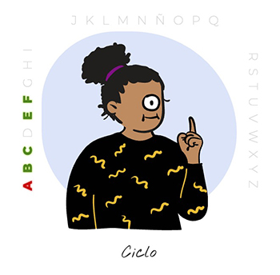

## DESCRIPCIÓN

Proyecto final del pre-curso de SkylabCoders. Aquí encontraréis todos los enunciados, ejercicios y challenges que os servirán para aprender a dominar la estructura básica de Javascript, HTML y CSS. Comprendiendo y dominando con soltura estos fundamentos os resultará más fácil llegar al nivel de Javascript al que os llevaremos una vez empiece el curso.

# PASAPALABRA WEB APP

## DESCRIPCIÓN

Bienvenidos al pre-curso de SkylabCoders, aquí encontraréis todos los enunciados, ejercicios y challenges que os servirán para aprender a dominar la estructura básica de Javascript, HTML y CSS. Comprendiendo y dominando con soltura estos fundamentos os resultará más fácil llegar al nivel de Javascript al que os llevaremos una vez empiece el curso.

<strong>El miércoles de la semana anterior al inicio del bootcamp se realizará la presentación de los proyectos del pre-curso. Elegid el proyecto que más os haya gustado, o el que os haya presentado más dificultad por ejemplo.</strong>

Para referencia teórica recomendamos utilizar las siguientes webs:

● Introducción a[ JavaScript](https://lenguajejs.com/p/javascript/)

● Introducción a[ HTML5](https://lenguajehtml.com/p/html/)

● Introducción a[ CSS](https://lenguajecss.com/p/css/)

Así, los objetivos del pre-curso son:

● Prepararos para poder empezar el curso con un buen nivel de Javascript.
